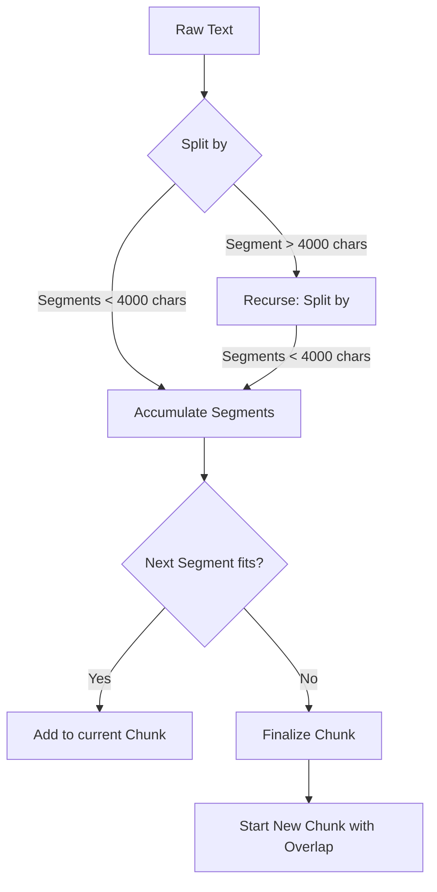

Based on the `chunks_js.json` and `raw_docs_js.json` files you provided, along with your configuration code, here is a detailed breakdown of how `RecursiveCharacterTextSplitter` works behind the scenes.

### The Core Concept: "Semantic" Splitting

The main goal of the `RecursiveCharacterTextSplitter` is to keep related text together. Unlike simpler splitters that might cut a sentence in half because it hit the 4000th character, this splitter tries to cut at "semantically meaningful" breaks (like paragraphs or new lines).

### 1\. The Hierarchy of Separators

Behind the scenes, the splitter utilizes a list of separators sorted by priority. By default, for specific text formats (and general text), it uses this hierarchy:

1.  `\n\n` (Double newline - usually separates paragraphs)
2.  `\n` (Single newline - usually separates lines or list items)
3.  `     ` (Space - separates words)
4.  `""` (Empty string - strictly character-by-character)

### 2\. The Algorithm (Step-by-Step)

Here is the logic flow the splitter executes using your config (`chunkSize: 4000`, `chunkOverlap: 200`):

#### Step A: The Attempt

The splitter takes your large document from `raw_docs_js.json`. It attempts to split the **entire text** using the first separator: `\n\n` (paragraphs).

#### Step B: Size Assessment

It looks at the resulting pieces (paragraphs).

- **If a piece is small enough (\< 4000 chars):** It keeps it as a potential part of a chunk.
- **If a piece is too big (\> 4000 chars):** It takes _only that specific piece_ and runs the algorithm again (recursively), but this time using the **next** separator in the list (`\n`).

#### Step C: The Merge (Building the Chunk)

Once the text is split into small enough pieces, the splitter starts merging them back together into a single chunk.

1.  It adds "Paragraph 1".
2.  It checks: `Length of (Paragraph 1 + Paragraph 2) < 4000?`
3.  If yes, it joins them.
4.  It continues adding paragraphs until adding the next one would exceed 4000 characters.
5.  **Stop:** The current chunk is finalized.

#### Step D: The Overlap

Before starting the _next_ chunk, it takes the last `200` characters (or the last logical unit that fits within 200 chars) from the _previous_ chunk and uses that as the **start** of the new chunk. This ensures context isn't lost between cuts.

---

### 3\. Visualizing with Your Data

Let's look at exactly what happened in your provided files to prove this logic.

#### Chunk 0 Analysis (From `chunks_js.json`)

- **Content:** Starts at "Skip to main content..." and ends at "...Jump to a different step in the agent lifecycle".
- **Logic:** The splitter kept adding paragraphs until it reached the section discussing "Data sources".
- **Why it stopped:** Adding the next section (about "Data sources") likely would have pushed the total size over 4000 characters, or it found a clean break point at the end of the "How it works" section.

#### The "Overlap" in Action

You can see the `chunkOverlap: 200` working perfectly between Chunk 0 and Chunk 1.

**End of Chunk 0:**

```text
Middleware allows you to hook into any step in the agent lifecycle and:

Update context
Jump to a different step in the agent lifecycle
```

**Start of Chunk 1:**

```text
Update context
Jump to a different step in the agent lifecycle

Throughout this guide, you’ll see frequent use of the middleware API...
```

**Explanation:**

1.  The splitter finished Chunk 0.
2.  To create Chunk 1, it didn't start strictly at "Throughout this guide...".
3.  It "walked back" roughly 200 characters (or the nearest separator) into the previous text.
4.  It grabbed "Update context\\nJump to a different step in the agent lifecycle" and placed it at the start of Chunk 1.

### 4\. Why your chunks are less than 4000 characters

You might notice that your chunks in `chunks_js.json` are not exactly 4000 characters long (they are likely around 2000-3000).

- **Reason:** The splitter is "soft." If it has a chunk of 3500 characters, and the next paragraph is 600 characters, it will **not** split that paragraph just to fill the remaining 500 characters of space. It prefers to leave the chunk at 3500 and start a new one to keep the next paragraph intact.

### Summary Diagram



This "Recursive" nature is why it is the standard for LLM contexts—it respects the grammar and structure of your document (code blocks, paragraphs, lists) rather than blindly chopping bytes.
